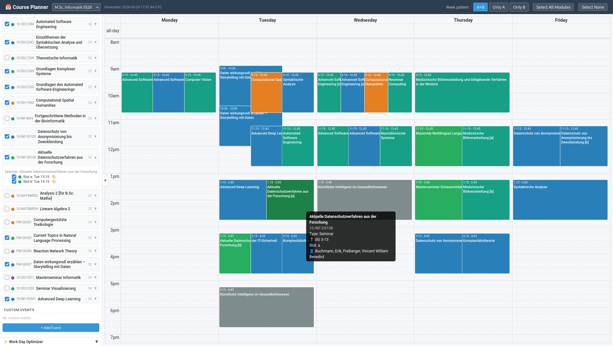

# courseview

visualize available courses in a weekly calender view

link: https://nunq.github.io/courseview/

## features
- persists the selected courses in browser's localstorage
- search across available courses
- customize each course's colors
- add your own custom events into the schedule (also persisted)
- get suggestions on which days to go to work instead of uni (brute forces the minimum number of conflicts with the selected courses)

## local setup

- get your `inf-bachelor.html` / `inf-master.html`
- `python parse.py -i input.html -o datasets/courses_(ba|ma)_(ss|ws)YY.json`
- add it to the manifests file `datasets/manifest.json`
- `python -m http.server 8000 -b 127.0.0.1`

---

note: this code was fully generated using llms
