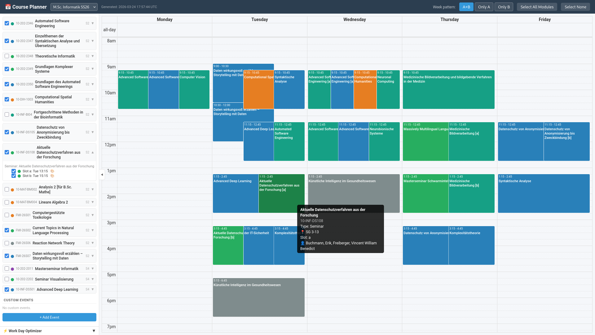

# courseview

visualize available courses in a weekly calender view, desktop screen required

link: https://nunq.github.io/courseview/



## features
- persists the selected courses in browser's localstorage
- search across available courses
- customize each course's colors
- clicking on an event in the calendar highlights it in the course list
- add your own custom events into the schedule (also persisted)
- import custom weekly events from a JSON file
- export the selected courses as an `ics` file which can be imported into any calendar
- get suggestions on which days to go to work instead of uni (brute forces the minimum number of conflicts with the selected courses)
- for zoom, just use your browser's zoom `ctrl +`

## local setup

- get your `inf-bachelor.html` / `inf-master.html`
- `uv run parse.py -i input.html -o datasets/courses_inf-(ba|ma)_(ss|ws)YY.json`
- add it to the manifests file `datasets/manifest.json`
- `python -m http.server 8000 -b 127.0.0.1`

## import custom events

Click **Import JSON…** under Custom Events. The file should contain an array of weekly events; `room`, `notes`, and `color` are optional. Import appends events to your existing custom events.

```json
[
  {
    "title": "Study group",
    "day": "wednesday",
    "timeStart": "15:00",
    "timeEnd": "16:30",
    "room": "Library",
    "notes": "Bring exercises",
    "color": "#3498db"
  }
]
```

Days can be `monday` through `friday`; times use 24-hour `HH:MM` format.

---

note: this code was fully generated using llms
